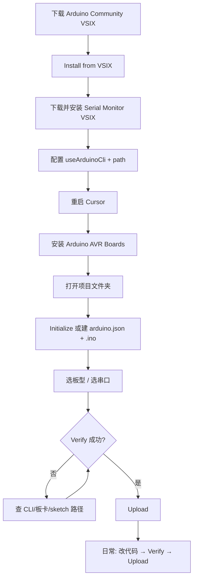

# Cursor 与 Arduino 连接配置手册

> 适用环境：Windows + Cursor + Arduino UNO R3 / Mega 2560  
> 扩展：Arduino Community Edition（`vscode-arduino-community`）  
> 基于实际配置与踩坑整理，可作为新电脑/新项目的标准流程。

---

## 一、流程总览

```text
阶段 1：安装 Arduino 扩展（VSIX 手动安装）
    ↓
阶段 2：安装 Serial Monitor 依赖扩展（VSIX）
    ↓
阶段 3：全局 Arduino CLI 配置（一次性）
    ↓
阶段 4：安装板卡支持包（一次性）
    ↓
阶段 5：新建项目并初始化（每个 Arduino 项目一次）
    ↓
阶段 6：选板型 / 选串口 → Verify → Upload
```

---

## 二、背景说明（为什么 Cursor 里不好装）

| 现象 | 原因 |
|------|------|
| 扩展市场搜不到官方 Arduino 插件 | 微软官方扩展已停更；Cursor 使用 Open VSX，不全 |
| 搜不到 PlatformIO | 同上，需 VSIX 手动安装 |
| 扩展显示已启用但命令报错 `command not found` | 扩展依赖未满足，**从未真正激活** |
| Select Serial Port 报 Serial Monitor API 错误 | 缺少 `ms-vscode.vscode-serial-monitor` |

**推荐方案：** Arduino Community Edition + 手动 VSIX + Arduino CLI（不必安装 Arduino IDE）

---

## 三、阶段 1：安装 Arduino Community Edition 扩展

### 3.1 下载 VSIX

1. 打开 [vscode-arduino Releases](https://github.com/vscode-arduino/vscode-arduino/releases)
2. 下载最新版 **`vscode-arduino-community-x.x.x.vsix`**（win32-x64）

**备用下载方式：**

- 在 VS Code 扩展市场搜 `vscode-arduino-community` → 齿轮 → Download VSIX
- 社区工具：[vsix-downloader](https://zpratikpathak.github.io/vsix-downloader)

### 3.2 在 Cursor 中安装

1. `Ctrl+Shift+P` → **Extensions: Install from VSIX...**
2. 选择下载的 `.vsix` 文件
3. **完全重启 Cursor**

### 3.3 验证扩展已安装

`Ctrl+Shift+X` → 应看到 **Arduino Community Edition**（来源：VSIX）

---

## 四、阶段 2：安装 Serial Monitor 扩展（必装）

Arduino 扩展的 **选串口、串口监视器** 依赖 Microsoft **Serial Monitor** 扩展。

### 4.1 命令行安装（推荐）

在 PowerShell 中（将 URL 版本号以 Releases 最新为准）：

```powershell
# 下载 VSIX 到本地后安装
cursor --install-extension "路径\ms-vscode.vscode-serial-monitor-xxx.vsix"
```

或：`Ctrl+Shift+P` → **Extensions: Install from VSIX...**

### 4.2 验证

重启 Cursor 后，`Ctrl+Shift+P` → **Arduino: Select Serial Port** 应能列出 COM 口，不再报 API 错误。

---

## 五、阶段 3：全局 Arduino CLI 配置（一次性）

在 **Cursor 用户设置**（`settings.json`）中添加：

```json
{
    "arduino.useArduinoCli": true,
    "arduino.path": "C:\\Users\\你的用户名\\.cursor\\extensions\\vscode-arduino.vscode-arduino-community-0.7.1\\assets\\platform\\win32-x64\\arduino-cli",
    "arduino.commandPath": "arduino-cli.exe"
}
```

> 路径中的扩展版本号 `0.7.1` 若升级扩展后变了，需同步修改。

### 5.1 关键配置说明

| 配置项 | 作用 | 默认值问题 |
|--------|------|------------|
| `arduino.useArduinoCli` | 使用 Arduino CLI 而非 Arduino IDE | **默认为 false**，会去找未安装的 IDE |
| `arduino.path` | CLI 所在目录 | 不设置时可能找不到工具 |
| `arduino.commandPath` | CLI 可执行文件名 | 一般为 `arduino-cli.exe` |

### 5.2 验证 CLI 可用

```powershell
& "$env:USERPROFILE\.cursor\extensions\vscode-arduino.vscode-arduino-community-0.7.1\assets\platform\win32-x64\arduino-cli\arduino-cli.exe" version
```

---

## 六、阶段 4：安装板卡支持包（一次性）

### 6.1 在 Cursor 中安装

`Ctrl+Shift+P` → **Arduino: Board Manager** → 搜索并安装：

```text
Arduino AVR Boards
```

（UNO R3 和 Mega 2560 均包含在内）

### 6.2 命令行安装（备用）

```powershell
$cli = "$env:USERPROFILE\.cursor\extensions\vscode-arduino.vscode-arduino-community-0.7.1\assets\platform\win32-x64\arduino-cli\arduino-cli.exe"
& $cli core update-index
& $cli core install arduino:avr
```

### 6.3 板型 ID 速查

| 板子 | Board Manager 名称 | FQBN（arduino.json） |
|------|-------------------|----------------------|
| Arduino UNO R3 | Arduino Uno | `arduino:avr:uno` |
| Arduino Mega 2560 | Arduino Mega or Mega 2560 | `arduino:avr:mega` |

---

## 七、阶段 5：新建 Arduino 项目（每个项目一次）

### 7.1 推荐目录结构

```text
my_project/
├── .vscode/
│   ├── arduino.json      ← 板型、串口、sketch 路径
│   └── settings.json     ← 可选，项目级 CLI 配置
└── my_project/
    └── my_project.ino    ← 文件夹名与 .ino 主文件名必须一致
```

### 7.2 方式 A：扩展初始化（推荐）

1. **文件 → 打开文件夹**（必须打开文件夹，不要只开单个 .ino）
2. `Ctrl+Shift+P` → **Arduino: Initialize**
3. 无 `.ino` 时按提示创建，如 `sketch.ino`
4. 选择板型（Uno / Mega）
5. 扩展会生成 `.vscode/arduino.json`

### 7.3 方式 B：手动创建

**`.vscode/arduino.json` 示例（UNO）：**

```json
{
    "sketch": "blink/blink.ino",
    "board": "arduino:avr:uno",
    "port": "COM4"
}
```

**Mega 2560：** 将 `board` 改为 `"arduino:avr:mega"`。

### 7.4 新项目不需要重复配置的项

| 项目 | 是否每个项目重做 |
|------|------------------|
| 安装 Arduino / Serial Monitor 扩展 | 否（全局一次） |
| `arduino.useArduinoCli` 等全局设置 | 否 |
| 安装 Arduino AVR Boards | 否 |
| `.vscode/arduino.json` | **是** |
| 选板型、选串口 | **是**（或写入 arduino.json） |

---

## 八、阶段 6：编译与上传

### 8.1 上传前检查

```
□ USB 已连接，设备管理器中有 COMx
□ 板型选对（UNO / Mega）
□ 串口选对（Arduino: Select Serial Port）
□ 串口未被 Arduino IDE / 串口监视器占用
□ 当前打开的是项目文件夹（含 .vscode/arduino.json）
```

### 8.2 编译与上传

| 操作 | 命令面板 | 说明 |
|------|----------|------|
| 编译 | **Arduino: Verify** | 仅检查能否编译通过 |
| 上传 | **Arduino: Upload** | 编译并写入板子 |
| 选板型 | **Arduino: Change Board Type** | UNO / Mega |
| 选串口 | **Arduino: Select Serial Port** | 如 COM4 |
| 串口监视 | **Arduino: Open Serial Monitor** | 需 Serial Monitor 扩展 |

### 8.3 查看输出日志

**查看 → 输出** → 下拉选 **Arduino**

### 8.4 命令行备用脚本

项目内可使用 `arduino.ps1`（不依赖扩展 UI）：

```powershell
cd 项目目录

.\arduino.ps1 ports
.\arduino.ps1 verify -Board uno
.\arduino.ps1 upload -Board uno -Port COM4
.\arduino.ps1 upload -Board mega -Port COM4
```

---

## 九、常见问题与解决方案

### 9.1 Git / 环境类

| 问题 | 原因 | 解决方案 |
|------|------|----------|
| Cursor 终端找不到 `git` | PATH 快照过旧 | 完全重启 Cursor |
| 扩展命令 `command not found` | 扩展未激活 | 见 9.2 |

### 9.2 扩展无法激活 / 命令不存在

| 问题 | 原因 | 解决方案 |
|------|------|----------|
| `arduino.selectSerialPort` not found | 扩展从未 activate | 检查依赖、激活配置 |
| 扩展显示 Enabled 但命令不可用 | `extensionDependencies` 未满足 | 安装 Serial Monitor；或移除依赖并设 `activationEvents: ["*"]` |
| Board Manager / Initialize 失败 | `useArduinoCli` 为 false，找 IDE | 设 `arduino.useArduinoCli: true` 并指定 CLI 路径 |
| Initialize 跳过 | 工作区无 `.ino` | 创建 `.ino` 或 Initialize 时输入文件名 |
| `Cannot find the command file` | 未装 Arduino IDE 且未用 CLI | 启用 CLI 并配置 path |

**依赖说明（Arduino Community Edition 0.7.1）：**

- 官方声明依赖：`ms-vscode.cpptools`、`ms-vscode.vscode-serial-monitor`
- Cursor 中 cpptools 可选（影响 IntelliSense）
- **Serial Monitor 必装**（否则选串口报错）

### 9.3 Serial Monitor 相关

| 问题 | 原因 | 解决方案 |
|------|------|----------|
| `Serial Monitor API was not retrieved` | 未装 Serial Monitor 扩展 | VSIX 安装 `ms-vscode.vscode-serial-monitor` 后重启 |
| 选串口列表为空 | 未插 USB / 驱动未装 | 检查设备管理器、CH340 驱动 |

### 9.4 上传 / 硬件类

| 问题 | 原因 | 解决方案 |
|------|------|----------|
| `avrdude: stk500_recv()` | 端口/板型/线材 | 换 COM、确认 UNO/Mega、换 USB 线 |
| 找不到 COM 口 | 克隆板 CH340 无驱动 | 安装 [CH340 驱动](http://www.wch-ic.com/downloads/CH341SER_EXE.html) |
| 编译慢（首次） | 下载工具链 | 正常，等待完成 |
| 上传时端口被占用 | IDE 或监视器占串口 | Close Serial Monitor 后重试 |

### 9.5 扩展补丁说明（若仍无法激活）

对 **已安装的** `vscode-arduino-community` 扩展目录，必要时需：

1. `package.json`：移除 `extensionDependencies`；`activationEvents` 设为 `["*"]`
2. `.vsixmanifest`：清空 `ExtensionDependencies` 属性

> 扩展升级后补丁可能被覆盖，需重新处理或改用 VSIX 安装前改包。

---

## 十、Cursor 特有注意事项

| 事项 | 说明 |
|------|------|
| 打开方式 | 必须 **打开文件夹**，不要只打开单个 `.ino` |
| 扩展来源 | Arduino / Serial Monitor 均建议 **VSIX 安装** |
| 重启 | 改 settings、装扩展后需 **完全重启 Cursor** |
| 与 Git 独立 | Git 配置与 Arduino 无关；`.vscode/arduino.json` 可提交到仓库 |
| 非管理员终端 | 改 ssh-agent 等与 Arduino 无关；Arduino 不需管理员 |

---

## 十一、检查清单

### 一次性（新电脑）

```
□ 安装 vscode-arduino-community（VSIX）
□ 安装 ms-vscode.vscode-serial-monitor（VSIX）
□ 用户 settings 配置 useArduinoCli + arduino.path
□ Board Manager 安装 Arduino AVR Boards
□ CLI 命令行 version 正常
□ USB 驱动（CH340 等）已装
```

### 每个新项目

```
□ 打开项目文件夹
□ Arduino: Initialize（或手动建 .vscode/arduino.json）
□ 创建 文件夹名/文件夹名.ino
□ Change Board Type（uno / mega）
□ Select Serial Port
□ Verify 通过
□ Upload 成功，板载 LED 或功能正常
```

### 每次改代码后

```
□ 保存 .ino
□ Arduino: Verify（可选）
□ Arduino: Upload
```

---

## 十二、命令速查表

| 目的 | 命令面板 / 操作 |
|------|-----------------|
| 初始化项目 | Arduino: Initialize |
| 选板型 | Arduino: Change Board Type |
| 选串口 | Arduino: Select Serial Port |
| 编译 | Arduino: Verify |
| 上传 | Arduino: Upload |
| 串口监视 | Arduino: Open Serial Monitor |
| 板卡管理 | Arduino: Board Manager |
| 库管理 | Arduino: Library Manager |

**arduino.json 关键字段：**

```json
{
    "sketch": "blink/blink.ino",
    "board": "arduino:avr:uno",
    "port": "COM4"
}
```

---

## 十三、完整流程图



---

## 十四、附录：Blink 示例与 LED_BUILTIN

**最小示例 `blink/blink.ino`：**

```cpp
void setup() {
  pinMode(LED_BUILTIN, OUTPUT);
}

void loop() {
  digitalWrite(LED_BUILTIN, HIGH);
  delay(1000);
  digitalWrite(LED_BUILTIN, LOW);
  delay(1000);
}
```

- `LED_BUILTIN` 在 UNO/Mega 的板卡库中定义为 **13**（`pins_arduino.h`）
- 板载 LED 硬件已接到 D13，无需在代码里「连接」

---

## 十五、相关文档

- 同目录：`Cursor-GitHub-Setup.md`（Git / GitHub 配置）
- 项目脚本：`arduino.ps1`（CLI 编译上传备用）

---

*文档版本：2026-07-06*
