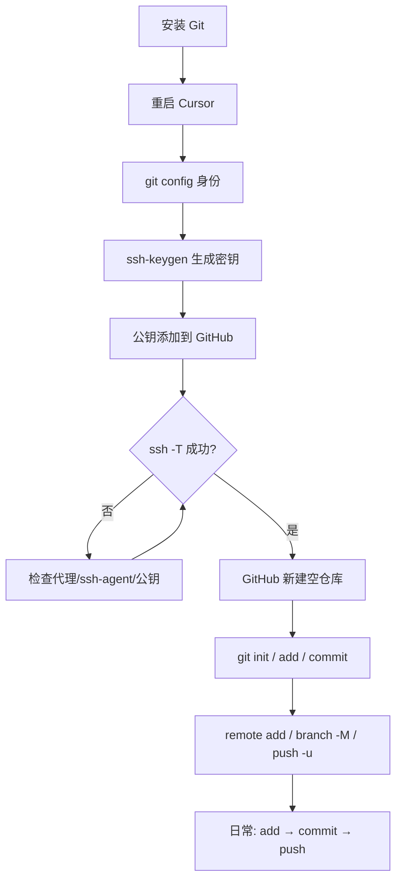

# Cursor 与 GitHub 连接配置手册

> 适用环境：Windows + Cursor + GitHub（SSH 方式）  
> 基于实际配置与踩坑整理，可作为新项目/新电脑的标准流程。

---

## 一、流程总览

```text
阶段 1：环境准备（Git 可用）
    ↓
阶段 2：Git 身份配置（一次性）
    ↓
阶段 3：SSH 认证配置（一次性）
    ↓
阶段 4：新建项目并绑定 GitHub（每个项目一次）
    ↓
阶段 5：日常开发（add → commit → push / pull）
```

---

## 二、阶段 1：环境准备

### 2.1 安装 Git

1. 下载安装 [Git for Windows](https://git-scm.com/download/win)
2. 安装时 PATH 选项选：**Git from the command line and also from 3rd-party software**
3. **完全退出并重启 Cursor**（重要）

### 2.2 验证 Git 可用

在 Cursor 终端执行：

```powershell
git --version
```

应显示类似：`git version 2.x.x`

### 2.3 常见问题

| 问题 | 原因 | 解决方案 |
|------|------|----------|
| `git 无法识别为 cmdlet` | Cursor 启动时 PATH 是旧快照 | 完全重启 Cursor；或临时刷新 PATH：<br>`$env:Path = [System.Environment]::GetEnvironmentVariable('Path','Machine') + ';' + [System.Environment]::GetEnvironmentVariable('Path','User')` |
| 系统变量已有 Git 但仍报错 | 同上 | 重启 Cursor，不要只关终端面板 |

---

## 三、阶段 2：Git 身份配置（一次性）

```powershell
git config --global user.name "你的GitHub用户名"
git config --global user.email "你的GitHub注册邮箱"
git config --global core.editor "cursor --wait"
```

### 验证

```powershell
git config --global --list
```

### 说明

- `user.name` / `user.email`：会出现在每次 commit 记录里
- `core.editor`：写 commit message 时用 Cursor 打开（可选）

---

## 四、阶段 3：SSH 认证配置（一次性）

> GitHub **不支持**用登录密码 push，必须用 **SSH 密钥** 或 **Personal Access Token**。推荐 SSH。

### 4.1 生成 SSH 密钥

```powershell
ssh-keygen -t ed25519 -C "你的GitHub邮箱"
```

- 保存路径：直接回车（默认 `C:\Users\你的用户名\.ssh\id_ed25519`）
- passphrase：可留空（方便）；设密码更安全

### 4.2 启用 ssh-agent（可选，建议）

**管理员 PowerShell** 中执行（只需一次）：

```powershell
Set-Service ssh-agent -StartupType Manual
Start-Service ssh-agent
ssh-add $env:USERPROFILE\.ssh\id_ed25519
```

> 若未设 passphrase，即使 ssh-agent 未启用，SSH 通常仍可用。

### 4.3 添加公钥到 GitHub

```powershell
Get-Content $env:USERPROFILE\.ssh\id_ed25519.pub | Set-Clipboard
```

1. 打开 [GitHub → Settings → SSH keys](https://github.com/settings/keys)
2. **New SSH key** → 粘贴公钥 → 保存

### 4.4 配置 SSH（推荐，走 443 端口）

创建/编辑 `C:\Users\你的用户名\.ssh\config`：

```text
Host github.com
  HostName ssh.github.com
  Port 443
  User git
  IdentityFile ~/.ssh/id_ed25519
  IdentitiesOnly yes
```

### 4.5 测试连接

```powershell
ssh -T git@github.com
```

成功应显示：

```text
Hi 你的用户名! You've successfully authenticated...
```

### 4.6 SSH 常见问题

| 问题 | 原因 | 解决方案 |
|------|------|----------|
| `Permission denied (publickey)` | 公钥未添加或密钥未加载 | 检查 GitHub SSH keys；执行 `ssh-add -l` |
| `Connection closed by 198.18.0.x` | Clash/VPN Fake-IP 拦截 | 将 `github.com`、`ssh.github.com` 设为 DIRECT；或关闭 TUN；或临时关代理 |
| `ssh-agent` 启动失败 | Windows 默认禁用该服务 | 管理员执行 `Set-Service ssh-agent -StartupType Manual` |
| `Error connecting to agent` | ssh-agent 未运行 | 同上；或无 passphrase 时可不依赖 agent |
| DNS 解析到 `198.18.0.x` | 代理 Fake-IP | 见上；`Resolve-DnsName github.com` 应不再是 198.18.0.x |

---

## 五、阶段 4：新建项目并绑定 GitHub（每个项目一次）

### 5.1 在 GitHub 创建空仓库

1. [https://github.com/new](https://github.com/new)
2. 填写仓库名
3. **不要**勾选 “Add a README”（本地已有代码时）
4. 复制 **SSH 地址**：`git@github.com:用户名/仓库名.git`

### 5.2 本地三条命令的作用（首次提交前）

| 命令 | 作用 | 是否依赖远程 |
|------|------|--------------|
| `git init` | 当前文件夹变成 Git 仓库（创建 `.git`） | 否 |
| `git add .` | 把改动放入暂存区，准备 commit | 否 |
| `git commit -m "Initial commit"` | 在本地保存第一个版本快照 | 否 |

> 这三步都可以在连接 GitHub 之前完成；但 `push` 前至少要有 commit。

### 5.3 本地初始化并首次推送

```powershell
cd C:\path\to\你的项目文件夹

git init
git add .
git commit -m "Initial commit"

git remote add origin git@github.com:用户名/仓库名.git
git branch -M main
git push -u origin main
```

### 5.4 三条「连接远程」命令说明

| 命令 | 作用 |
|------|------|
| `git remote add origin git@github.com:...` | 绑定 GitHub 远程地址（别名 `origin`） |
| `git branch -M main` | 本地主分支命名为 `main`，与 GitHub 一致 |
| `git push -u origin main` | 首次推送，并记住 upstream，以后可直接 `git push` |

### 5.5 首次推送常见问题

| 问题 | 原因 | 解决方案 |
|------|------|----------|
| `Authentication failed` | 用了密码而非 SSH/Token | 确认 SSH 测试通过；remote 用 `git@github.com:...` |
| `failed to push some refs` | 远程有 README 等初始提交 | 先 `git pull origin main --rebase` 再 push，或建空仓库 |
| 无内容可 push | 未 commit | 先 `git add` + `git commit` |

---

## 六、阶段 5：日常开发流程（每次改代码）

```powershell
cd 项目文件夹

git status              # 查看改了什么（可选）
git add .               # 暂存所有改动
git commit -m "描述修改内容"
git push                # 推到 GitHub
```

从 GitHub 同步到本地：

```powershell
git pull
```

### 重要原则

- **`push` 只上传已 `commit` 的内容**
- 改完文件必须：`add` → `commit` → `push`
- 只 `push` **不会**上传未 commit 的修改

### 删除文件（推荐方式）

```powershell
git rm 文件名
git commit -m "删除 xxx"
git push
```

若在 GitHub 网页删除，本地需：

```powershell
git pull
```

---

## 七、Cursor 特有注意事项

| 事项 | 说明 |
|------|------|
| 终端 PATH | Cursor 继承启动时环境变量；改 PATH 后需**完全重启 Cursor** |
| 是否管理员 | Cursor 终端默认**非管理员**；改系统服务需单独开管理员 PowerShell |
| Source Control 面板 | 左侧分支图标可可视化 add / commit / push，底层仍是 Git |
| 关机重启 | SSH 密钥、Git 配置持久保存，**无需重新配置** |

---

## 八、新项目快速检查清单

### 一次性（新电脑 / 首次）

```
□ Git 已安装，Cursor 终端中 git --version 正常
□ git config user.name / user.email 已设置
□ SSH 密钥已生成并添加到 GitHub
□ ssh -T git@github.com 成功
□ （可选）~/.ssh/config 已配置 443 端口
```

### 每个新项目

```
□ GitHub 上已创建空仓库
□ git init
□ git add . && git commit -m "Initial commit"
□ git remote add origin git@github.com:用户/仓库.git
□ git branch -M main
□ git push -u origin main
□ GitHub 网页上能看到代码
```

### 每次改代码后

```
□ git add .
□ git commit -m "说明"
□ git push
```

---

## 九、命令速查表

| 目的 | 命令 |
|------|------|
| 查看状态 | `git status` |
| 暂存改动 | `git add .` |
| 提交 | `git commit -m "说明"` |
| 推送到 GitHub | `git push` |
| 从 GitHub 拉取 | `git pull` |
| 查看历史 | `git log --oneline` |
| 查看远程 | `git remote -v` |
| 修改远程地址 | `git remote set-url origin git@github.com:用户/仓库.git` |
| 测试 SSH | `ssh -T git@github.com` |

---

## 十、完整流程图



---

## 十一、附录：与 Arduino 等其它工具的关系

- **Git/GitHub 配置**：全局一次，所有项目共用
- **每个 Git 项目**：需单独 `git init` + 绑定远程
- **Arduino 项目**：除 Git 外，还需 `.vscode/arduino.json`（或 `Arduino: Initialize`），与 Git 配置无关

---

*文档版本：2026-07-06*
